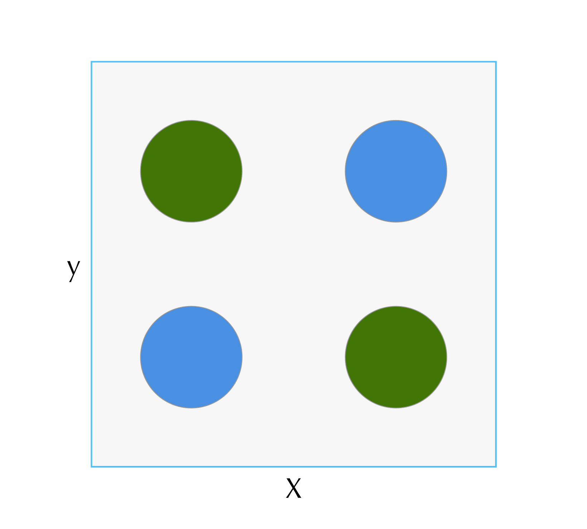
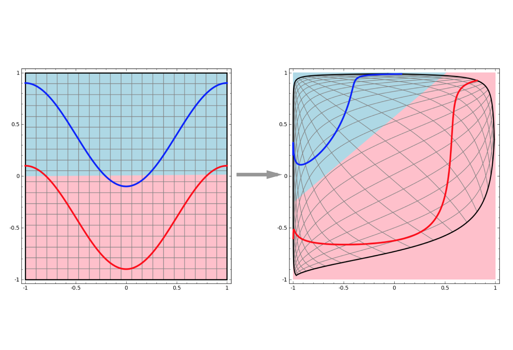
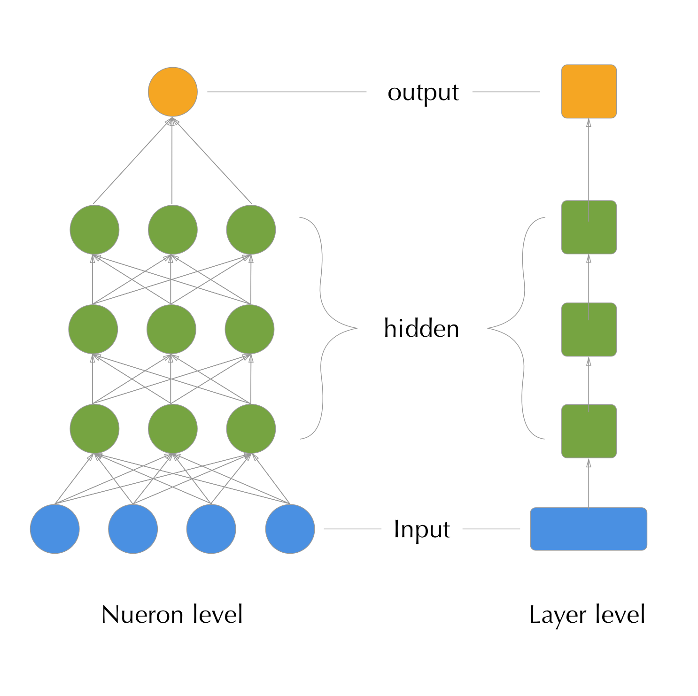
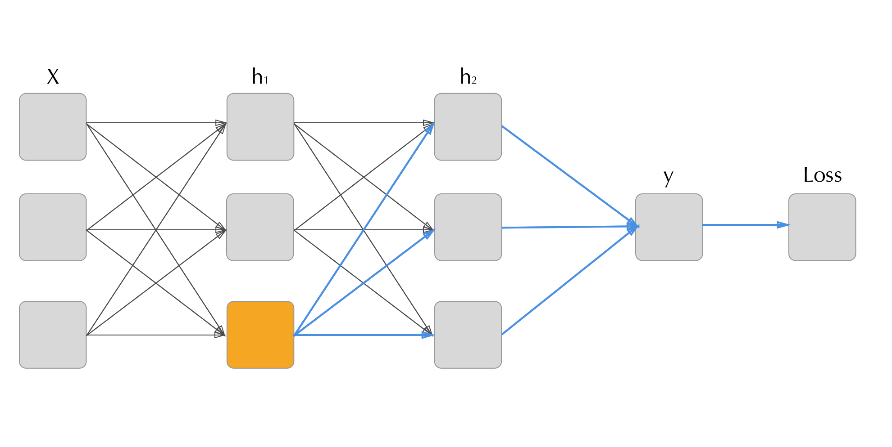
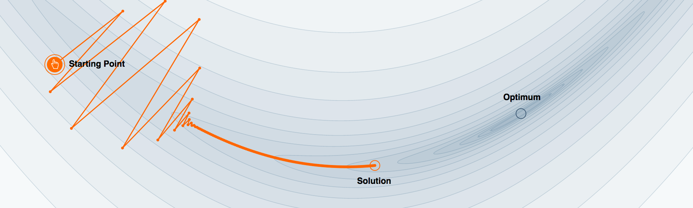

# Neural Networks {#neuralnetworks}

> A multilayer perceptron is just a mathematical function mapping some set of input values to output values. The function is formed by composing many simpler function. We can think of each application of a different mathematical function as providing a new representation of the input. (@goodfellow_DL)

Neural networks (sometimes referred to as multilayer perceptrons) are at their core very simple models. Traditional modern neural networks pass data forward through a "network" that at each layer, performs a linear (also referred to as affine) transformation of its inputs followed by a element-wise non-linear transformation (also called an activation function). In doing this they can build up successively more complex representations of data and use those to make decisions about it. 

This can be thought about in the analogy of recognizing a cat. First you see ears, a nose, two eyes, four feet, and a tail; next, you recognize the ears, nose and eyes as a head, the tail and legs as a body; and lastly the head and body as a cat. In performing this 'classification' of a cat you first constructed small features and successively stacked them to figure out what you were looking at. While this is obviously a stretched definition of how neural networks work, it actually is very close to how a special variant called Convolutional Neural Networks work for computer vision techniques (@cnn_vis). 

## History

While neural networks' popularity has taken off in recent years they are not a new technique. The neuron or smallest unit of a neural network was first introduced in 1943 (@mcculloch_neuron). It was then another 15 years until the perceptron (now commonly called 'neural network') was introduced (@rosenblatt_perceptron) that tied together groups of neurons to represent more complex relationships. 

Another ten years later, in a textbook (@minsky_perceptrons) it was shown that a simple single layer perceptron was incapable of solving certain classes of problems like the "And Or" (XOR) problem (\@ref(fig:xorproble)). This is due to the separating hyperplane found by a single layer perceptron being a linear combination of the input values. This forces the classes to themselves be linearly separable, which the XOR problem is not. The authors argued that the only way for a perceptron to overcome this hurdle would be to be stacked together, which, while appealing, was not possible to be trained effectively at the time. 


```{r, echo = FALSE, label="xorproble", out.width= "50%", fig.align = "center", fig.cap = "Example of the XOR problem. Classes encoded by color are not linearly seperable."}

```


It wasn't until 1986 that a realistic technique for training these multi-layer perceptrons was introduced (@backprop_1986). Finally all of the algorithmic pieces were in place for deep neural networks, but interest stagnated due to the computational expense of training the networks, a lack of data, and the success of other competing machine learning algorithms. 

Interest in the field of deep learning has had a massive resurgence in the second decade of the 21st century. Driven by growing stores of data and innovations in neural network architectures. One commonly cited tipping point for the current "deep learning revolution" was the 2012 paper (@imagenet_2012) in which a deep convolutional neural network won the ImageNet prize and showed massive improvements over traditional methods. 

### Biological Inspirations
The word 'neural' in the 'neural network' is reference to the fact that these models derive inspiration from how the brain works. With the individual nodes in a hidden 'layer' frequently being called a 'neuron'. While the broad concepts may be similar between the way animal brains and neural networks work, the similarities are minimal. With animal brains relying not only on the connections and firing of the neurons but also the chemical concentrations and interactions of the two not yet fully understood. 

There has however, been some recent work trying to more closely mimic brain structure with architectures such as capsule networks (@capsnet). These networks introduce another level of architectural hierarchy to the neural network system, the capsule: a collection of neurons within a layer. These capsules attempt to recognize the existence of features of the input data, while also modeling the feature's transformation and position. This deals with the problem of traditional neural networks failing to recognize when input features are transformed (e.g. an upside down mug is not recognized by the same feature detectors as a right side up mug). Neuroscience experiments have demonstrated that at least part of our visual system does truly perform these hierarchical stacks of features when recognizing objects (@cnn_animals). 

### Geometric Interpretation
Another way of thinking of how neural networks work is as a building up a series of successive transformations of the data-space that attempt to eventually let the data be linearly separable ((\@ref(fig:geometricinterp)). 
In this interpretation each layer can be seen as a shift and rotation of the data (the linear transformation), followed by a warping of the new space (the activation function). In his excellent blog post: [Neural Networks, Manifolds, and Topology](http://colah.github.io/posts/2014-03-NN-Manifolds-Topology/), Chris Olah gives an excellent visual demonstration of this.

```{r, echo = FALSE, label="geometricinterp", fig.align = "center", fig.cap = "Example of how a neural network can, through a series of affine transformations followed by non-linear squashings, turn a linearly inseperable proble into a linearly seperable one. Image courtesy of [Chris Olah's blog](http://colah.github.io/posts/2014-03-NN-Manifolds-Topology/)"}

```

## Universal Approximation Theorem 
One powerful theoretical result from neural networks is that they are universal approximators (@universal_approximators). A neural network with a single hidden layer and non-linear activations functions on that layer can represent _any_ borel-measurable function. This result means that there are no theoretical limits on the capabilities of neural networks. Obviously, in real-world situations this is not the case. We can not have infinite width hidden layers, infinite parameters requires infinite data, and even more limiting are our inefficient learning methods. All constraints considered though, the universal approximation theorem does provide confidence that, as long as they are properly constructed and trained, neural networks are amazingly flexible models. 


## The Computation Graph
While the building blocks of neural networks are simple, often complete models are composed of hundreds to even thousands of neurons and millions of connections and representing them in mathematical notation becomes exceedingly difficult. A method of dealing with this complexity, along with also helping in the intuition of many other properties, is to represent the networks as a 'computation graph.'

A computation graph is simply directed acyclic diagram that shows the flow of data through the model. Each neuron is usually represented as a circle with the weights both in and out of the neuron's value represented as edges.


```{r, echo = FALSE, label="compgraph", fig.align = "center", fig.cap = "A neural network computation graph at two levels of detail: the neuron left (left) and the layer level (right)."}

```

Sometimes, when the models get even larger, the layers (or groups of neurons) will get lumped into a single node in the graph (as on the right of figure \@ref(fig:compgraph).)


## Terminology

When covering the basic mathematical operations of a neural network it helps to have a reference for some of the terms that get used. This list provides the most commonly used terms for the models we will be describing. 

__Neuron__: An individual node in the network. Has two values: activation, or the value of the linear function of all inputs, and the post-activation-function value, or a simple transformation of the activation by the activation function. 

__Affine Transformation__: A linear transformation of an input (either data input or a hidden layer's output). Essentially a linear regression. 

__Bias Term__: A constant term added to the affine transformation for a given neuron. Also known as an 'intercept term.'. For notational simplicity in most of our formulas we will omit this. 

__Activation Function__: A non-linear function that takes an input and 'squashes' it to some range. A common activation function is the sigmoid, which takes an unbounded real-valued input and returns a value between -1 and 1. 

__Layer__: A collection of neurons who's inputs typically share the same inputs (either another layer's output or the data).

__Hidden Layer__: A layer who's input is the output of a previous layer and who's output is another layer. E.g. Input layer -> hidden layer -> output layer.

## Mathematical Operations


The basic operations that one does on a neural network really fall into two categories. Forward propagation, or the passing of data into and through subsequent layers of the model to arrive at an output, and back-propagation, or the calculation of the gradient of each parameter in the model by stepping back through the model from the loss function to the input. For a more thorough treatment of these steps see @goodfellow_DL chapter six. 

### Forward Propagation

Let a neural network with $l$ layers and $k$ dimensional input $X$ and $m$ dimensional output $\hat{y}$ attempting to predict the true target $y$. Each layer is composed of $s_i, i \in \{1, 2, ...,l\}$ neurons and has respective non-linear activation function $f_i$. The output of a layer after affine transformation is represented as a vector of length $s_i$: $\underline{a_i}$ and the layer output vector post-activation function outputs: $\underline{o_i}$. The weights representing the affine transition from one layer $i$ to layer $j$ are a matrix $W_i$ of of size $s_{i} \times s_j$. Finally the network has a differentiable with respect to $\hat{y}$ loss function: $L(\hat{y}, y)$. In the case of categorical outcomes $\hat{y}$ corresponds to the probability of the class of interest. This is some times referred to as $\hat{p}$, or $\hat{p}_i$ in the multi-class situation, where $i$ corresponds to one of $k$ output classes. For simplicity of notation we will use $\hat{y}$ to represent both the continuous and categorical cases here. 

Forward propagation then proceeds as follows. 

1. Input $X$ $(1 \times k$) is multiplied by $W_1$ (size $(k\times s_i)$ ) to achieve the _activation values_ of the first hidden layer. 
    - $X \cdot W_1 = \underline{a_1}$
2. The $(1 \times s_1)$ activation vector of the first layer is then run element-wise though the first layer's non-linear activation function to achieve the output of layer 1. 
    - $\underline{o_1} = f_1(\underline{a_1})$
3. This series of operations is then repeated through all the layers, (using the subsequent layers output vector as the input to the next layer,) until the final layer is reached.
    - $\underline{o_i} = f_i(\underline{o_{(i - 1)}} \cdot W_i)$
4. Finally, the loss is calculated from the output of our final layer.
    - $L_n = L(\underline{o_l}, y) = L(\hat{y}, y)$
  
  
While not strictly necessary for forward propagation, the intermediate layer activations and output vectors are kept stored so they can be used in the later calculation of the gradient via back propagation.

### Back Propagation

If we are just looking to gather predictions from our model we can stop at forward propagation. However, most likely we want to train our model first. The most common technique for training neural networks is using a technique called back propagation (@backprop_1986). In this algorithm the chain rule is used to walk back through the layers of the model starting from the loss function to the input weights in order to calculate each weight's gradient with respect to the average loss over training samples (or expected loss)^[Commonly a modification of gradient descent called stochastic gradient descent is used, which relies on using a subset of the data to calculate the expected lost at each step for efficiency.]. This gradient is then descended using any number of gradient descent algorithms. 


#### The Chain Rule

Back propagation is nothing more than a repeated application of the chain rule from calculus. Let $x$ be a single dimensional real valued input that is mapped through first equation $f$ and then $g$, both of which map from a single dimensional real number to another single dimensional real number: $f(x) = z, g(z) = y$ or $g(f(x)) = y$. The chain rule states that we can calculate the derivative of the outcome with respect to the input by a series of multiplications of the derivatives of the composing functions.

\begin{equation} 
  \frac{dy}{dx} = \frac{dy}{dz}\frac{dz}{dx}
  (\#eq:chainrule)
\end{equation} 


This single dimensional example could be thought of as a neural network composed of two layers, each with a single dimension. The single dimensional case is illuminating, but the value of the chain rule comes when it is applied to higher dimensional values. 

#### Expanding to higher dimensions

Now, let $\mathbb{x} \in \mathbb{R}^m$ and $\mathbb{z} \in \mathbb{R}^n$. The function $f$ maps from $\mathbb{R}^m \to \mathbb{R}^n$ and $g: \mathbb{R}^n \to \mathbb{R}$. Further, let $\textbf{z} = f(\textbf{x})$ and $y = g(\textbf{z})$. The chain rule can then be expressed as: 

\begin{equation} 
  \frac{dy}{dx_i} = \sum_{j}\frac{dy}{dz_j}\frac{dz_j}{dx_i}
  (\#eq:chainrulemv)
\end{equation} 

Or that the derivative of $y$ with respect to the $i^{\text{th}}$ element of $\textbf{x}$ is the sum of the series of products of the derivatives of result $\textbf{z}$ that sits between the two values in the function composition. 

Another way of thinking of this is, the derivative of the output of the function composition $f \circ g$ with respect to some element of the input is the sum of all of the derivatives of all of the paths leading from the input element to the output. 


```{r, echo = FALSE, fig.align = "center", fig.cap = "How back Propagation steps back from the output to the input. To calculate the gradient with respect to the loss of the orange neuron the we need to aggregate the gradients of all connected points further along in the computation graph (blue connections)."}

```


#### Applied to Neural Networks

To apply this technique to neural networks we need to make sure all components of our network are differentiable and then walk back from the loss function to the last (or output) layer, calculating the gradients of the output layer's neurons with respect to the loss. Once we have calculated the gradients with respect to the weights of the output layer we only need use those calculated gradients to calculate the gradients of the preceding layer. We can then proceed layer by layer, walking back through the model filling out each neuron's weight gradients until we reach the input. 

To calculate the gradient of the weights for hidden layer $i$ we can recall that the hidden layers output can be represented as $\textbf{a}_i = f_i(\textbf{W}\cdot\textbf{a}_{(i -1)})$ (we're omitting the bias term here for simplicity). Thus to calculate the gradient's on the weights we can set $\textbf{g}^*_i = \textbf{g}_{i+1} \odot f'(a_{i+1})$ to be the gradient un-activated by our layer's activation function's derivative. Then to find the derivative with respect to each neuron's weights within the layer we multiply this un-activated gradient by the transpose of the layer's output vector: $\textbf{g}_i = \textbf{g}^*_i \textbf{o}_i^t$. 


The fact that the calculation of these gradients is so simple is fundamental to deep learning. By ensuring that the flow of error is acyclic and all transforming functions are divisible, a deep neural network can be trained with extremely simple mathematical operations. If it were more complicated, extremely large networks (such as those used in computer vision) with millions of parameters to tune would simply be computationally infeasible to calculate gradients for. Conveniently, the run time of the back propagation is a simple product of the number of neurons in each layer and the number of layers in the whole model. 

#### Other methods

Non-gradient based techniques have been explored for neural networks but have ultimately proven to slow for any realistic sized network. For instance evolutionary strategies (@evostrat), a new technique proposed by a group at OpenAi uses random searches of the parameter space with evolutionary algorithms to tune the model's parameters. However, since often these parameter spaces are millions of dimensions, an extremely large number of random perturbations are needed to inform a good direction to move ^[These do find use when methods are used when the loss function does not have a gradient. Such as reinforcement learning scenarios.].


## Training

### Gradient Descent

Once the gradient is computed, optimization proceeds the same way any gradient-based optimization problem does. The simplest algorithm for doing so being the steepest descent algorithm. In this algorithm, each weight for our network is updated by adding its gradient multiplied by a small scalar called a 'learning rate' ($\alpha$). 

$$\theta^{(j)} = \theta^{(j - 1)} + \alpha\Delta_{\theta}$$

The new updated weights are then used in another forward propagation, followed by another back propagation and weight update. This processes is repeated until the loss finds a minimum or some other stopping criteria is defined (such as a given number steps) is satisfied. 

### Gradient Descent Modifications

There are many scenarios in which traditional steepest descent is not an ideal for finding minimums of the loss function. A classic example is when the loss function takes the form of a long trough (\@ref(fig:badloss). In this case steepest descent will spend most of its time bouncing around between the sides of the trough due to over stepping the low point, thus wasting many of its iterations undoing its previous work rather than progressing in the true direction of the minimum. 


```{r, echo = FALSE, fig.align = "center", label = 'badloss', out.width = "100%", fig.cap = "Demonstration of steepest descent's limitations on trough like gradient surfaces. Much of each step's progress is wasted on bouncing back and forth between the two walls of the gradient rather than descending directly towards the minimum. Image from @momentum"}

```


One of the most common additions to plain gradient descent is the addition of momentum. Momentum makes each step a function of not only the current gradient but also a decaying average of previous generations. For a thorough overview of momentum based methods see @momentum.

## Activation Functions

There are many different possible activation functions. The only conditions that an activation function needs to satisfy is that it takes an unbounded real input and returns some non-linear transformation of that input that is differentiable with respect to the input. 

One of the simplest functions used is the sigmoid which simply squashes the neuron's activation from all real numbers to between 0 and 1. A newer and extremely common choice is the rectified linear unit (Relu) function (@relu_paper).

```{definition, label = "sigmoid", name="sigmoid activation function"}
$$f(x) = e(x)/(1 + e(x))$$
```


```{definition, label = "relu", name="Rectified Linear Unit activation function"}
$$f(x) = \text{max}(0,x)$$
```


```{r, fig.align = "center", out.width = "85%", echo = F, fig.cap = 'Comparison of the relu and sigmoid activation functions.'}
library(tidyverse)

relu <- function(x) ifelse( x > 0, x, 0)
sigmoid <- function(x) exp(x)/(1 + exp(x))
x_range <- seq(-5,5, length.out = 100)

dplyr::data_frame(
  x = x_range,
  relu = relu(x),
  sigmoid = sigmoid(x)
) %>% 
  gather(func, value, -x) %>% 
  ggplot(aes(x = x, y = value)) +
  geom_line() +
  labs(y = 'f(x)') +
  facet_grid(func~., scales = "free_y")
```

Another, popular loss function that is used on the output layer when predicting categories is the softmax function. Unlike the previously mentioned loss functions this one takes a vector $\textbf{o}$ of length $m$ representing the output of each of the layer's neurons. 


```{definition, label = "softmax", name="Softmax activation function."}
$$f(\textbf{o})_i = \frac{\text{exp}(o_i)}{\sum_{j = 1}^m \text{exp}(o_j)}$$
```

This function serves to turn the output of a layer into a multivariate probability vector. The $m$ outputs of the softmax sum to one. ^[It is important to note that, while the values sum to one, it's not a true probability output, but will help indicate which class is most likely and roughly by what magnitude over other potential class choices.] 


## Loss functions

Like any machine learning model, neural networks have a loss function (sometimes called a cost function), or a function that helps the model know how close it is to performing as desired.  As previously mentioned, in the case of neural networks we almost always want our loss function to be differentiable with respect to our model's output $\hat{\textbf{y}}$ as the derivative is needed for calculating the gradient on which the model is trained. 

### Likelihoods

Almost always the loss function is derived from a likelihood function. A likelihood function is chosen based upon a parametric model that is assumed to represent the distribution of outcomes for a model with parameters (weights) $\mathbb{\theta}$, after conditioning on the input data. 

```{definition, label = "likelihood", name="Likelihood function"}
$$P(\mathbb{\theta}, \mathbb{y}|\mathbb{x}) = P_{\text{model}}(\mathbb{y} | \mathbb{x})$$
```

For example, with a continuous outcome model it is commonly assumed that the outcome $y$ corresponding to input $\mathbb{x}$ will be normally distributed. Due to this assumption, the loss function is derived from the likelihood equation of the normal model. 

Optimization then becomes a task of manipulating the parameters of the network $\mathbb{\theta}$ such that the predicted conditional distribution of the output is as close as possible to the observed conditional distribution. The 'distance' from the conditional distribution is a quantity referred to as the Kullback-Leibler divergence. 

```{definition, label = "kld", name="Expected Kulback-Leibler Divergence"}
$$\text{KLD(model, observed)} = \sum_{i \in \text{observations}}P_{\text{observed}}(\mathbb{y_i} | \mathbb{x_i}) \cdot \log{\frac{P_{\text{observed}}(\mathbb{y_i} | \mathbb{x_i})}{P_{\text{model}}(\mathbb{y_i} | \mathbb{x_i})}}$$
```


```{definition, label = "negloglik", name="General maximum likelihood loss function"}
$$J(\theta) = - \mathbb{E}_{x,y \sim \hat{p} \text{ data}} \log{{p_{\text{model}}(\textbf{y} |\textbf{x} })}$$
```

```{definition, label = "estnegloglik", name="Estimated maximum likelihood loss function"}
$$\hat{J}(\theta) = {- \sum}_{i \in \text{observations}} \log{{p_{\text{model}}(\textbf{y} |\textbf{x} })}$$
```

The precise form of the maximum likelihood loss function will change depending on the model. Next we will briefly introduce the two classes of loss functions: regression and classification, and the most commonly used functions within those classes. 

### Regression loss functions

When fitting a neural network who's outcome is a single real numbered variable $\hat{y}$ the most common loss function used is the mean square error. 

```{definition, label = "mse", name="Expected mean squared error loss"}
$$\text{MSE}(\theta) = -\frac{1}{n} \sum_{i = 1}^{n} (\hat{y}^{(i)} - y^{(i)})^2$$
  
Where $y_i$ represents the outcome of the $i^{\text{th}}$ observation of $n$ training observations.
```

This assumes that the output, when conditioned on the input, takes the form of a normal distribution. Minimizing the mean squared error is equivalent to maximizing the conditional normal likelihood function (@goodfellow_DL chapter 5.5) and is thus a maximum likelihood method. 


### Classification loss functions

There are two separate instances of classification that need to be considered. The binary case, where we are classifying a yes or no answer for a single class, or a categorical case, where we have more than two possible classes to choose from and need to place our data into one of them. 

In the single outcome case the approach is to assume the outcome is a Bernoulli distribution over outcome $y$ conditioned on the input $x$. The resultant loss function is commonly referred to as 'binary cross entropy.'^[It is interesting to note that while we typically only use the term 'cross entropy' for categorical outcomes, any time we are minimizing KL or maximizing the likelihood we are minimizing the cross entropy. So technically we could also call the mean squared error the 'continuous cross entropy loss.']

```{definition, label = "crossentropy", name="Expected binary cross entropy loss"}
$$L(\theta) = -\frac{1}{n}\sum_{i = 1}^n\left[ y_i\log(\hat{y}_i) + (1 - y_i)\log(1 - \hat{y}_i)\right]$$
```

This can be generalized into the multivariate case by swapping a multinomial model as the conditional distribution and thus adding more terms to the internal summation representing each possible class and its assigned probability. 

```{definition, label = "catcrossentropy", name="Expected categorical cross entropy loss"}
$$L(\theta) = -\frac{1}{n}\sum_{i = 1}^n\sum_{j = 1}^k y_{i,j}\log(\hat{y}_{i,j})$$

Where $y_{i,j}$ represents the $i^{\text{th}}$ observation's value for the $k^{\text{th}}$ category (dummy encoded). 
```

### Other loss functions

While it is possible to use other loss functions in neural networks, it is commonly not advised as the maximum-likelihood methods perform just as well and usually results in a more robust fit to the data. As deep learning situations usually have a large number of training observations the Cramer-Rao lower bound property, that a maximum likelihood estimator has the lowest variance of any consistent estimator, is particularly relevant. For a more thorough overview of the common loss functions used in deep learning see @goodfellow_DL chapter six.


## Avoiding Overfitting

Neural networks have a large number of parameters or weights that need to be tuned in order to minimize their loss. Whenever there are this many knobs to tune a large concern is overfitting to the training data, leaving the model unable to generalize.

Neural networks have many ways of dealing with overfitting, some common to almost all machine learning methods, and some specific to neural networks. 

### Parameter penalization

Perhaps the most common way of dealing with overfitting is by penalizing the parameters. In this case the model's loss function adds a term that 'penalizes' large parameters. By doing this the model tries to find a balance between fitting the data well and also keeping its weights small. There are two primary penalization methods, $L1$ penalization, where the sum of the absolute value of the parameters is added to the loss, and $L2$ penalization, where the sum of the squares of the weights are added to the loss. 

```{definition, label = "l1penalization", name="L1 penalization"}
For a model with a $k$-dimensional parameter space and a penalization amount, $\lambda$: 
$$L_{L1}(\theta) = \hat{L}(\theta) + \lambda \sum_{j = 1}^{k}|\theta_j|$$
```

```{definition, label = "l2penalization", name="L2 penalization"}
$$L_{L2}(\theta) = \hat{L}(\theta) + \lambda \sum_{j = 1}^{k}\theta_j^2$$
```

$L1$ penalization tends to shrink parameter weights to zero, where as $L2$ shrinks them asymptotically to zero. 

The parameter of $\lambda$ corresponds to the severity of penalization for large weights. It is often tuned by comparing the training loss of the model with the validation or test loss and attempting to find a value of $\lambda$ that shrinks the losses to each other (but not over as to avoid under-fitting).

### Dropout

Another method of avoiding overfitting that is unique to neural networks is the technique known as dropout (@dropout). While training, the activation amounts of given neurons are randomly set to zero (or dropped) with probability $P_{\text{drop}}$. This prevents the model from overfitting the data by never allowing it to tune weights such that they simply memorize the training data, as if it does its predictions will be very poor when random neurons are dropped. When the model is then used in a testing scenario no neurons are dropped but the weights are scaled back by $1 - P_{\text{drop}}$ to account for the fact that more neurons are contributing to the answer than were when the model was trained.

Dropout has been shown to be a very effective, if counter-intuitive, method for avoiding overfitting and is used extremely commonly. 

### Early Stopping

Another common method of avoiding overfitting is stopping the gradient-descent processes early. A rule is used to decide when the optimization process is terminated: commonly when the validation loss does not decrease for a given number of steps.

Early stopping is often combined with a technique known as gradient-clipping, whereby the steps of the gradient descent are not allowed to exceed a given size. 
This serves as a regulation method because it sets a bounds on how far the parameters can move: (# steps) $\cdot$ (max step size).

