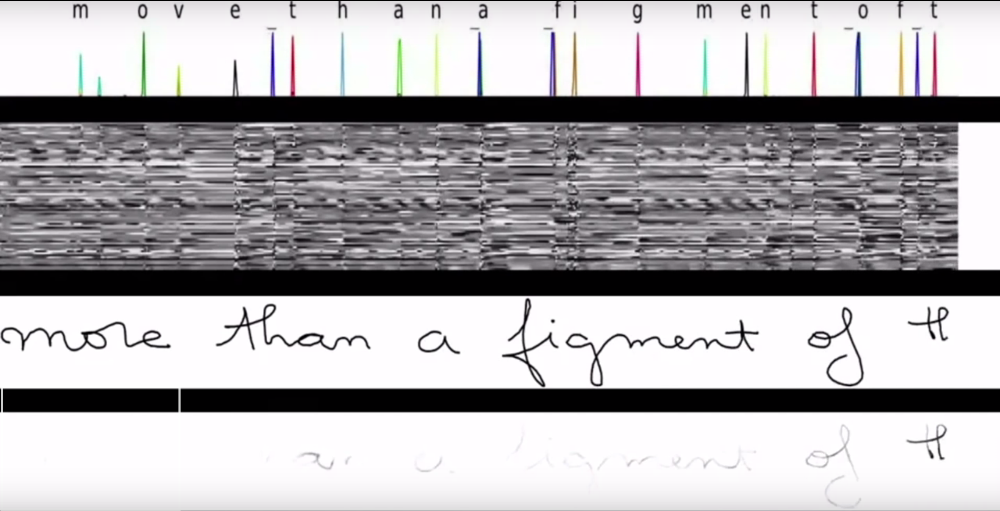

# Architectures For Sequence Learning {#architectures}

In the previous chapter we described the general neural network architecture. This is usually called a dense-neural feed-forward networks. 'Dense' refers to the fact that all neurons of a given layer are connected to all nuerons of the successive layer. 'Feed-forward' refers to the fact that data flows into the network and straight to the output, traveling only forward through the layers. In this section we will expand upon this general model with different architectures: the recurrent neural network (RNN) (@rnn_intro) and the convolutional nueral net (CNN) (@cnn_intro). 

It is important to note that while these models are in fact sub-models of the dense feed-forward networks from the last chapter, just with restrictions placed on weights in the form of deleting connections (setting weight to 0) or sharing weights between multiple connections. 

These restrictions applied to standard neural networks allow the models to more efficiently model tasks related to sequential data by reducing the number of parameters that need to be fit or, in some cases, helping with the propigation of the gradients for efficient training. 


## Terminology 

Throughout this chapter we will refer to an input $\textbf{x}$ which is a single observation of $t$ time points. In addition, we have an outcome $\textbf{y}$, also of length $t$ that represents some state or property of the system generating $x$ at each time point. This could be the type of road a car is driving on, the sentiment of a speaker, or the next $x_i$ value (e.g. next word in a sentence). 


## Recurrent Neural Networks

One way to efficiently deal with the fact that sequential data is often highly correlated between observations is to fit a model to each time-point observation and then pass it information on what was happening prior. The model can then combine the previous information with the newly observed input to come up with a prediction. 

This can be accomplished in a nueral network by adding recurrent links between layers. Typically, this is done by passing the hidden layer (or layers) of the network the values of itself at the previous time point. I.e. $\textbf{h}_{t} = g(\textbf{x}_t, \textbf{h}_{t - 1})$. The idea behind this is that the hidden layer learns to encode some 'latent state' of the system that is informative for its output, and so letting the model know what that latent state was previously will help it update the latent state and provide an accurate output. 

Why not just pass the output at time $(t-1)$ to the hidden state at $t$ instead? While this is possible, and indeed works much better than not communicating information between time points at all, it suffers from the squashing of the latent state information to out outcome of interest. This results in a loss of information about what is happening in the system since the hidden or latent state to the outcome is not neccesarily a one-to-one function. In addition, there is conveneince in the fact that the hidden state is already of the same dimension, allowing for a simple element-wise addition of the components from the previous hidden state and the new input information. 

```{r,  out.height = 320, echo = FALSE, label = "cyclegraph", fig.cap = "A recurrent neural network with a single hidden layer. The hidden layer's values at time $t$ are passed to the hidden layer at time $(t + 1)$."}
knitr::include_graphics("figures/rnn_compact.png")
```


### Applications to sequential data 

RNN's are fundementally models for performing analysis on sequential data (although they have been applied to static inputs and used to generate sequential outputs (@rnn_captions)). Some of the major success stories in recurrent neural networks come in the realm of machine translation. For instance, Google's entire translation service is now powered by RNNs (@google_translate).

Other domains in which RNNs have been successfully applied is in time-series regression (@rnn_regression), speech recoginition (@rnn_speach), and handwriting recognition (@rnn_handwriting). 

```{r,  out.height = 320, echo = FALSE, fig.cap = "Example of an RNN's output for recognizing characters in handwritten characters. The model scans along one slice at a time of the data and the output is character likelihood. Still from [youtube video](https://www.youtube.com/watch?v=mLxsbWAYIpw) by Nikhil Buduma."}

```

### Successes in natural language processing 

One of the areas that has seen great results from the application of RNNs is natural language processesing. Natural language processesing (or NLP) refers broadly to the modeling of textual data in order to infer things like sentiment, predict next words, or even generate entirely new sentences. 

Usage of neural networks for these tasks has greatly improved upon previous techniques that constrained were constrained by linear assumptions (e.g. word2vec (@word2vec)) or limited ability to look backwards in time. 

<!-- #### Abstracts Example -->

### Cyclical Computation Graph

A natural question that arrises from the cyclical computational graph shown in figure \@ref(fig:cyclegraph) is how the gradient can be calculated via back propigation. In fact, the cycle as represented is just a visual simplification of the true computational graph. The 'unrolled' graph can be throught of as a long chain of neural networks that share connections between sequential hidden layers. 

```{r,  out.height = 320, echo = FALSE, label = "unrolledgraph", fig.cap = "Unrolled view of the RNN shown in previous figure. Each timestep has two outputs, the timesteps predictions and its hidden state. The next time step subsequently has two inputs: the data at the timepoint and the previous timepoint's hidden state."}
knitr::include_graphics("figures/rnn_unrolled.png")
```

So in fact, we still satisfy the requirement of a directed acylic computation graph, just it is convenient to represent the unique layers in the graph in a single cyclical diagram.

### Weight sharing

A recurrent neural network is actually a very large neural network with a bunch of outputs, so it should be hard to train, correct? The secret to RNNs having maintainable parameter quantities is weight sharing. In the unrolled graph every layer has the same weights. This means that the hidden layer always parses the input data with the same affinine function and combines it with the previous hidden state in the same way; likewise, with the same hidden state activations, the model output will always be the same. 

In order to calculate gradients, first an initial hidden state is defined (usually all zeros) and then forward propigation is carried out through all $t$ timepoints of the input. Then, back propigation starts from the last output and proceeds all the way back through the computation graph. The resulting gradient descent updates are a function of the average of all of the gradients calculated. This procedure, although technically no different from plain back propigation is known as the _back-propigation through time_ (BPTT) algorithm. For a thorough overview of the form of the gradient equations for BPTT see @goodfellow_DL chapter 10.2.2.

### Problems with exploding and vanishing gradients

One way to think of an RNN is a series of function compositions over time. Much like a 'deep' neural network is a series of function compositions through it's layers, the unrolled computation graph of the RNN is 'deep' in time. While a traditional feed forward network typically have somewhere between two and ten layers of this composition, RNNs can have hundreds of steps of this composition as sequences are commonly very long (e.g. time series data collected every second for a day: $t= 86,400$). When this many compositions are performed negative side effects tend to accumulate. This largest being the problem of the exploading and vanishing gradients (@vanishing_gradient, @bengio_gradient). 

To illustrate this problem we can think of an extremely simple RNN. One that has no input, a single hidden layer $\textbf{h}^{(i)}, i \in \{1, ..., t\}$, and no non-linear activation functions. We will denote the weights for mapping $\textbf{h}^{(i)} \to \textbf{h}^{(i + 1)}$ with $\textbf{W}$. We also assume that $\textbf{W}$ can be eigendecomposed to $\textbf{Q}\Lambda\textbf{Q}'$ where $\textbf{Q}$ is orthogonal and $\Lambda$ is the eigen matrix. This is obviously a functionally useless model, but it serves well to illustrate our problem. 

We can thus think of each step of our RNN through time in terms of matrix multiplication. 

\begin{equation} 
  \textbf{h}^{(t)} = \textbf{W}' \textbf{h}^{(t - 1)}
  (\#eq:simplernn1)
\end{equation} 

We can see that this equation can be simplified to a function of only the weight matrix and the first hidden state using the power method. 

\begin{equation} 
  \textbf{h}^{(t)} = \left[\textbf{W}^t\right]' \textbf{h}^{(0)}
  (\#eq:simplernn2)
\end{equation} 

Next we just need to substitute the eigendecomposition of $\textbf{W}$.

\begin{align} 
  \textbf{h}^{(t)} &= \left[(\textbf{Q}\Lambda\textbf{Q})^t\right]' \textbf{h}^{(0)} \\
                    &= \textbf{Q}'\Lambda^t \textbf{Q} \textbf{h}^{(0)} \\
  (\#eq:simplernn3)
\end{align} 

From the form of the function composition in \@ref(eq:simplernn3) allows us to see that while the eigen matrix is continuouly being raised to the $t$ power, it will cause it's eigenvalues with magnitude greater than one to diverge to infinity and those with magnitude less than one to converge to zero. 

This observation leads to the problem that, over any long term sequence our model will have a very hard time keeping track of dependencies. When applied to back propigation this is essentially means that the gradients associated with parameters linked to longer term dependencies will either vanish (go to zero) or expload (go to infinity). 

Due to the problems caused by this repeated function composition plain RNNs have generally proved unable to learn dependencies longer than a few time-steps^[@bengio_gradient showed that after only 10-20 steps the probability of successfully learning a dependency was effectively zero.], and when they do, they are outweighed by those closer in time, simply due to mathematical inconvenciences and not neccesarily information importance (@bengio_gradient, @graves_rnn). 


### Modern Extensions

There have been many proposed solutions to solving the problems associated with plain RNN's inability to learn long term dependencies. Some of them focus on forcing gradient's into good behavior by trying to constrain them close to one (@bounded_gradient_rnn) and others on adding 'skip connections' between times further apart than a single step (@skip_connections).  

While these methods do successfully allow RNNs to learn longer time dependencies, they are rather restrictive (forcing weights to have gradients near one can slow down training and inflate importance of some features and skip connections eliminate the benefit of the network learning the dependency lengths on its own). Next, we will introduce two methods to deal with the problems of learning long-term dependencies that have gained wide-spread adoption and generally dominate the techniques used. 

#### Long short term memory networks

A way of controlling how an RNN keeps track of different dependencies over time is to make that control flow part of the model itself and allow it to be learned. This is the concept that long short term memory (LSTM) networks (@lstm_intro) use. In the broadest sense, LSTM networks augment the traditional RNN architecture by adding a series of 'gates' that control which parts of the hidden state are remembered and used from time-step to time-step. 

```{r,  out.width = 400, echo = FALSE, label = 'lstmdiagram', fig.cap = "The internal structure of an LSTM hidden unit. The gates are all fed by the input at time _t_, the whole hidden unit at time (_t - 1_), and the hidden units internal state from time (_t - 1_). The gates themselves are linear combinations of the input that are then transformed by sigmoid activation functions."}
knitr::include_graphics("figures/lstm_cell.png")
```

It is important to note that an LSTM network is really just an RNN that has had the neurons a hidden layer replaced by a more complicated cell that controls its inputs and outputs along with having a secondary internal recrurrence to an internal state. See figure \@ref(fig:lstmdiagram) for the details of this internal cell. 

These gates are themselves simple little neurons that take linear combination of the input at time $t$, the hidden state at $(t - 1)$ and the lstm cell's internal state at $(t - 1)$ and produce an output that is squashed between zero (closed) and one (open) by a sigmoid activation function. The input gate will control what information makes it through to the unit internal state, the forget gate decides which information from the interal state gets recycled for the next time point, and the output gate decides what of the internal state is important to the next layer. 

While LSTMs are conceptually more complicated, their improvements in performance over standard RNNs is drastic (@lstm_intro). The network can now learn what features are important to it's given outcome at any given time, while at the same time filtering out information that it finds unneccesary in context. To give intuition to this we can imagine a basebal scenario. Say the batter hits a foul ball, that foul has different implications on the outcome of the at bat depending on how many strikes the player has when it occured. A traditional RNN would always choose to remember a foul the same, whereas an LSTM network could learn this contextual frame for importance. 

The major issue with LSTMs is how many parameters there are to learn. The number of parameter's associated with a neuron in a hidden layer jumps roughly 3 times over a standard RNN due to the weights neccesary for the gates. Due to this, LSTM's require a very large amount of data to effectively train and not overfit. In practice, these complications, combined with the recovery of some degrees of freedom through regularization, are worth it and LSTMs are by far the most common RNN-based architecture used today. However, some other approaches using similar methodologies have proven successful while reducing the number of parameters needed. 

#### Gated recurrent units

Introduced relatively recently (2014), Gated recurrent units (GRU)(@gru_intro), like LSTM, use gates to help control information flow through time, but it omits the extra recurrence step of the internal step from the LSTM and also sets the update and forget gates to be complements of eachother, thus accomplishing the task with a single gate. This is paired with a reset gate that controls how much of the hidden state from the previous timepoint makes it into the hidden state's input vector. 

```{r,  out.width = 400, echo = FALSE, label = 'grudiagram', fig.cap = "The internal structure of an GRU hidden unit. Unlike the LSTM there are only two gates, with the update and forget get tasks being taken care of by a single gate that controls what proportion to remember and what to forget. In addition, a reset gate controls how much of the hidden state from the previous step to bring into the current."}
knitr::include_graphics("figures/gru_cell.png")
```

While the GRU has fewer parameters to train, and does appear to perform better in lower data scenarios (@graves_rnn), in many cases the increased expressiveness of the LSTM allows for better performance. A recent large-scale survey of RNN architectures (@rnn_survey) found that on all benchmarks LSTM networks outperformed GRUs when using a systematic hyperparameter search. 

### Computational Hurdles
 

## Convolutional Neural Networks

### Application to spatially correlated data 

### Successes in computer vision

### Convolution as a kernel method

### Weight sharing

### Transformation invariance
