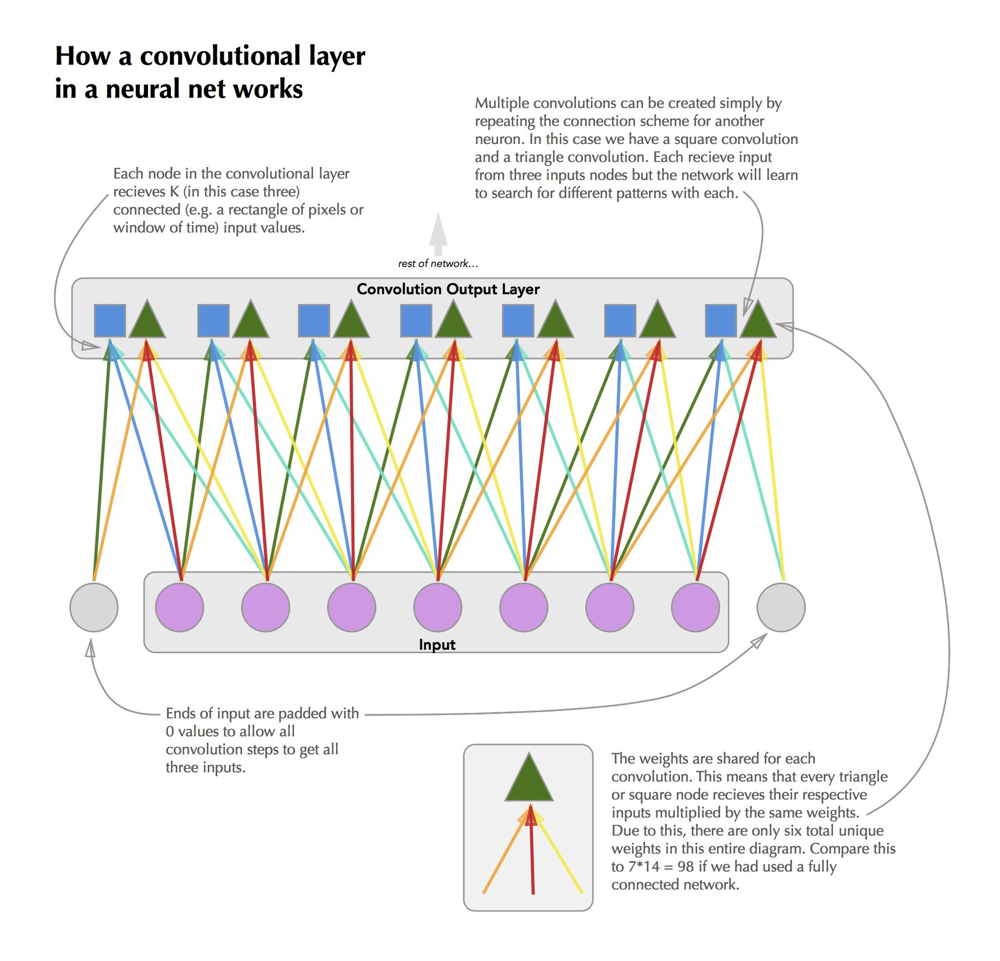

# Architectures For Sequence Learning {#architectures}

In the previous chapter we described the general neural network architecture. This is usually called a dense feed-forward network. 'Dense' refers to the fact that all neurons of a given layer are connected to all neurons of the successive layer. 'Feed-forward' refers to the fact that data flows into the network and straight to the output, traveling only forward through the layers. In this section we will expand upon this general model with different architectures: the recurrent neural network (RNN) (@rnn_intro) and the convolutional neural net (CNN) (@cnn_intro). 

While they are often represented as very different models, these architectures are in fact sub-models of the dense feed-forward networks from the last chapter, just with restrictions placed on weights in the form of deleting connections (setting weight to 0) or sharing weights between multiple connections. 

These restrictions applied to standard neural networks allow the models to more efficiently model tasks related to sequential data by reducing the number of parameters that need to be fit or, in some cases, helping with the propagation of the gradients for efficient training. 


## Terminology 

Throughout this chapter we will refer to an input $\mathbf{x}$ which is a vector of observations at $t$ time points. In addition, we have an outcome $\mathbf{y}$, also of length $t$ that represents some state or property of the system generating $x$ at each time point. This could be the type of road a car is driving on, the sentiment of a speaker, or the next $x_i$ value (e.g. next word in a sentence). 


## Recurrent Neural Networks

One way to efficiently deal with the fact that sequential data is often highly correlated between observations is to fit a model to each time-point and then pass it information on what was happening prior. The model can then combine the previous information with the newly observed input to come up with a prediction. 

This can be accomplished in a neural network by adding recurrent links between layers. Typically, this is done by passing the hidden layer (or layers) of the network the values of itself at the previous time point. I.e. $\mathbf{h}_{t} = g(\mathbf{x}_t, \mathbf{h}_{t - 1})$. The idea behind this is that the hidden layer learns to encode some 'latent state'^[This is in contrast with hidden markov models, which force the state use to infer the next step to be of the possible classes.] of the system that is informative for its output, and so letting the model know what that latent state was previously will help it update the latent state and provide an accurate output.

Why not just pass the output at time $(t-1)$ to the hidden state at $t$ instead? While this is possible, and indeed works much better than not communicating information between time points at all, it suffers from the squashing of the latent state information to out outcome of interest. This results in a loss of information about what is happening in the system since the hidden or latent state to the outcome is not necessarily a one-to-one function. In addition, there is convenience in the fact that the hidden state is already of the same dimension, allowing for a simple element-wise  addition of the components from the previous hidden state and the new input information. 

```{r,  out.width = "40%", echo = FALSE, fig.align = "center", label = "cyclegraph", fig.cap = "A recurrent neural network with a single hidden layer. The hidden layer's values at time $t$ are passed to the hidden layer at time $(t + 1)$."}
knitr::include_graphics("figures/rnn_compact.png")
```


### Applications to sequential data 

RNNs are fundamentally models for performing analysis on sequential data (although they have been applied to static inputs and used to generate sequential outputs (@rnn_captions)). Some of the major success stories in recurrent neural networks come in the realm of machine translation. For instance, Google's entire translation service is now powered by RNNs (@google_translate).

Other domains in which RNNs have been successfully applied is in time-series regression (@rnn_regression), speech recognition (@rnn_speach), and handwriting recognition (@rnn_handwriting). 

```{r,  out.width = "90%", echo = FALSE, fig.align = "center", fig.cap = "Example of an RNN's output for recognizing characters in handwritten characters. The model scans along one slice at a time of the data and the output is character likelihood. Still from [youtube video](https://www.youtube.com/watch?v=mLxsbWAYIpw) by Nikhil Buduma."}
knitr::include_graphics("figures/handwriting_rnn.png")
```

### Successes in natural language processing 

One of the areas that has seen great results from the application of RNNs is natural language processing. Natural language processing (or NLP) refers broadly to the modeling of textual data in order to infer things like sentiment, predict next words, or even generate entirely new sentences. 

Usage of neural networks for these tasks has greatly improved upon previous techniques that constrained were constrained by linear assumptions (e.g. word2vec (@word2vec)) or limited ability to look backwards in time. 

<!-- #### Abstracts Example -->

### Cyclical Computation Graph

A natural question that arises from the cyclical computational graph shown in figure \@ref(fig:cyclegraph) is how the gradient can be calculated via back propagation. In fact, the cycle as represented is just a visual simplification of the true computational graph. The 'unrolled' graph can be thought of as a long chain of neural networks that share connections between sequential hidden layers. 

```{r,  out.width = "65%", echo = FALSE, fig.align = "center", label = "unrolledgraph", fig.cap = "Unrolled view of the RNN shown in previous figure. Each timestep has two outputs, the timesteps predictions and its hidden state. The next time step subsequently has two inputs: the data at the timepoint and the previous timepoint's hidden state."}
knitr::include_graphics("figures/rnn_unrolled.png")
```

So in fact, we still satisfy the requirement of a directed acyclic computation graph, just it is convenient to represent the unique layers in the graph in a single cyclical diagram.

### Weight sharing

The unrolled graph representation shows that a recurrent neural network is actually a very large neural network, so unintuitively it should be hard to train. The secret to RNNs having maintainable parameter quantities is weight sharing. In the unrolled graph every layer has the same weights. This means that the hidden layer always parses the input data with the same affine function and combines it with the previous hidden state in the same way; likewise, with the same hidden state activation, the model output will always be the same^[We rely on the model to learn a hidden state that stores information from the past to avoid the problems with Markov processes]. 

In order to calculate gradients, first an initial hidden state is defined (usually all zeros) and then forward propagation is carried out through all $t$ time-points of the input. Then, back propagation starts from the last output and proceeds all the way back through the computation graph. The resulting gradient descent updates are a function of the average of all of the gradients calculated. This procedure, although technically no different from plain back propagation, is known as the _back-propigation through time_ (BPTT) algorithm. For a thorough overview of the form of the gradient equations for BPTT see @goodfellow_DL chapter 10.2.2.

### Problems with exploding and vanishing gradients

One way to think of an RNN is a series of function compositions over time. Much like a 'deep' neural network is a series of function compositions through it's layers, the unrolled computation graph of the RNN is 'deep' in time. While a traditional feed forward network typically have somewhere between two and ten layers of this composition, RNNs can have hundreds of steps of this composition as sequences are commonly very long (e.g. time series data collected every second for a day: $t= 86,400$). When this many compositions are performed negative side effects tend to accumulate. The largest being the problem of the exploding and vanishing gradients (@vanishing_gradient, @bengio_gradient). 

To illustrate this problem we can think of an extremely simple RNN. One that has no input, a single hidden layer $\mathbf{h}^{(i)}, i \in \{1, ..., t\}$, and no non-linear activation functions. We will denote the weights for mapping $\mathbf{h}^{(i)} \to \mathbf{h}^{(i + 1)}$ with $\mathbf{W}$. We also assume that $\mathbf{W}$ can be eigendecomposed to $\mathbf{Q}\mathbf{\Lambda}\mathbf{Q}'$ where $\mathbf{Q}$ is orthogonal and $\mathbf{\Lambda}$ is the eigen matrix. This is obviously a functionally useless model, but it serves to illustrate our problem. 

We can think of each step of our RNN through time in terms of matrix multiplication. 

\begin{equation} 
  \mathbf{h}^{(t)} = \mathbf{W}' \mathbf{h}^{(t - 1)}
  (\#eq:simplernn1)
\end{equation} 

This equation can be simplified to a function of only the weight matrix and the first hidden state using the power method. 

\begin{equation} 
  \mathbf{h}^{(t)} = \left[\mathbf{W}^t\right]' \mathbf{h}^{(0)}
  (\#eq:simplernn2)
\end{equation} 

Next, we substitute the eigendecomposition of $\mathbf{W}$.

\begin{align} 
  \mathbf{h}^{(t)} &= \left[(\mathbf{Q}\mathbf{\Lambda}\mathbf{Q})^t\right]' \mathbf{h}^{(0)} \\
                    &= \mathbf{Q}'\mathbf{\Lambda}^t \mathbf{Q} \mathbf{h}^{(0)} \\
  (\#eq:simplernn3)
\end{align} 

The form of the function composition in \@ref(eq:simplernn3) allows us to see that while the eigen matrix is continuously being raised to the $t$ power, it will cause its eigenvalues with magnitude greater than one to diverge to infinity and those with magnitude less than one to converge to zero. 

This observation leads to the problem that, over any long term sequence, our model will have a very hard time keeping track of dependencies. When applied to back propagation this is essentially means that the gradients associated with parameters linked to longer term dependencies will either vanish (go to zero) or explode (go to infinity). 

Due to the problems caused by this repeated function composition plain RNNs have generally proved unable to learn dependencies longer than a few time-steps^[@bengio_gradient showed that after only 10-20 steps the probability of successfully learning a dependency was effectively zero.], and when they do, they are outweighed by those closer in time, simply due to mathematical inconveniences and not necessarily information importance (@bengio_gradient, @graves_rnn). 


### Modern Extensions

There have been many proposed solutions to solving the problems associated with plain RNNs inability to learn long term dependencies. Some of them focus on forcing gradient's into good behavior by constraining them to be close to one (@bounded_gradient_rnn) and others on adding 'skip connections' between times further apart than a single step (@skip_connections).  

While these methods do successfully allow RNNs to learn longer time dependencies, they are rather restrictive (forcing weights to have gradients near one can slow down training and inflate importance of some features and skip connections eliminate the benefit of the network learning the dependency lengths on its own). Next, we will introduce two methods to deal with the problems of learning long-term dependencies that have gained wide-spread adoption and generally dominate the techniques used. 

#### Long short term memory networks

A way of controlling how an RNN keeps track of different dependencies over time is to make that control flow part of the model itself and allow it to be learned. This is the concept that long short term memory (LSTM) networks (@lstm_intro) use. In the broadest sense, LSTM networks augment the traditional RNN architecture by adding a series of 'gates' that control which parts of the hidden state are remembered and used from time-step to time-step. 

```{r,  out.width = "60%", echo = FALSE, fig.align = "center",  label = 'lstmdiagram', fig.cap = "The internal structure of an LSTM hidden unit. The gates are all fed by the input at time t, the whole hidden unit at time (t - 1), and the hidden units internal state from time (t - 1). The gates themselves are linear combinations of the input that are then transformed by sigmoid activation functions."}

```

It is important to note that an LSTM network is really just an RNN that has had the neurons a hidden layer replaced by a more complicated cell that controls its inputs and outputs along with having a secondary internal recurrence to an internal state. See figure \@ref(fig:lstmdiagram) for the details of this internal cell. 

These gates are themselves neurons that take linear combinations of the input at time $t$, the hidden state at $(t - 1)$ and the LSTM cell's internal state at $(t - 1)$ and produce an output that is squashed between zero (closed) and one (open) by a sigmoid activation function. The input gate will control what information makes it through to the unit internal state, the forget gate decides which information from the internal state gets recycled for the next time point, and the output gate decides what of the internal state is important to the next layer. 

While LSTMs are conceptually more complicated, their improvements in performance over standard RNNs is drastic (@lstm_intro). The network can now learn what features are important to its given outcome at a given time, while at the same time filtering out information that it finds unnecessary in context. To give intuition to this we can imagine a baseball game. Say the batter hits a foul ball, that foul has different implications on the outcome of the at bat depending on how many strikes the player has when it occurred. A traditional RNN would always choose to remember a foul the same, whereas an LSTM network could learn this contextual frame for importance. 

The major issue with LSTMs is how many parameters there are to learn. The number of parameter's associated with a neuron in a hidden layer jumps roughly three times over a standard RNN due to the weights necessary for the gates. Due to this, LSTMs require a very large amount of data to effectively train and not over-fit. In practice, these complications, combined with the recovery of some degrees of freedom through regularization, seem to be worth it and LSTMs are by far the most common RNN-based architecture used today. However, some other approaches using similar methodologies have proven successful while reducing the number of parameters needed. 

#### Gated recurrent units

Introduced relatively recently (2014), Gated recurrent units (GRU)(@gru_intro), like LSTM, use gates to help control information flow through time, but it omits the extra recurrence step of the internal step from the LSTM and also sets the update and forget gates to be complements of each other, thus accomplishing the task with a single gate. This is paired with a reset gate that controls how much of the hidden state from the previous time-point makes it into the hidden state's input vector. 

```{r,  out.width = "60%", echo = FALSE, fig.align = "center", label = 'grudiagram', fig.cap = "The internal structure of an GRU hidden unit. Unlike the LSTM there are only two gates, with the update and forget get tasks being taken care of by a single gate that controls what proportion to remember and what to forget. In addition, a reset gate controls how much of the hidden state from the previous step to bring into the current."}
knitr::include_graphics("figures/gru_cell.png")
```

While the GRU has fewer parameters to train, and does appear to perform better in lower data scenarios (@graves_rnn), in many cases the increased expressiveness of the LSTM allows for better performance. A recent large-scale survey of RNN architectures (@rnn_survey) found that on all benchmarks LSTM networks outperformed GRUs when using a systematic hyper-parameter search. 

### Computational Hurdles

The complications caused by RNNs propagating values/errors over many time steps is also the cause of the biggest computational hurdle associated with RNNs. When forward propagating or back propagating, we need to do it all in one sequential set of calculations. 

It is very common for neural network training to be multi-threaded using graphics processing units (GPUs). The reason this is effective is most of the calculations involved are simple and only depend on a few sequential layers, and thus it is very easy to run many training samples through the network in parallel to calculate their gradients and then aggregate those to a gradient descent step. However, with RNNs we must processes each sequence all the way though its (potentially very numerous) time steps. As a result, RNNs train much slower than other neural network architectures. 

There are a few general approaches to solving this. The simplest is to just stop back propagation at a certain number of steps, regardless of if the sequence has been fully processed yet. This is known as truncated back propagation through time (@trunc_bptt) and does often substantially speed up training, but at the obvious cost of limiting the length of time the network is able to look back in. 

Another technique is to modify the architecture of the RNN such that the hidden state receives input not from itself at the previous time point but the output at the previous time-point. This allows the model to be trained one time point at a time because the output from the next time step can be substituted with the observed value at that time step. While this approach massively speeds up training, as mentioned previously, it throws away some potentially valuable latent-space information that the model has learned. This approach has gained very little traction due to these limitations.

```{r,  out.width = "45%", echo = FALSE, fig.align = "center", label = 'outputrnn', fig.cap = "An RNN where the recurrent connection is made between the previous timepoint's output and the hidden unit. This model is less expressive than the traditional hidden - hidden architecture but is much easier to train."}

```

As both the number of observations as well as the number of time points grows the RNN architecture becomes increasingly strained and researchers have begun looking at other potential ways of modeling sequential data that allow for dynamic learning of temporal dependencies while training in reasonable amounts of time. The most promising approach thus far has been using convolutional neural networks. 


## Convolutional Neural Networks

While CNNs have garnered a great amount of attention in recent years for their successes in computer-vision they were originally introduced as a method for modeling time-series data (@hinton_cnn)[^Although at the time they were called time-delay neural networks.]. A convolutional neural network is one where a convolution (, or window that detects features such as edges,) is run over the spatially connected dimensions of the data in order create a map where a given feature is located. 

### Application to spatially correlated data 

In the context of image recognition this mapping means scanning a two-dimensional block of pixels over the range of the picture to detect important features in the data. In time-series data this window is one dimensional (e.g. a five minute window) and it scans exclusively along the sequence detecting some feature. 

### Feature Learning

The power of neural networks comes in with the fact that these feature recognizers are learned. This is in contrast with traditional approaches where the features to be extracted had to be manually curated. Usually some number of convolution's are initialized for a given model and are allowed to learn the patterns that help them best minimize the loss function. Interestingly, in the case of computer-vision, sometimes fascinating patterns are learned that mimic what one might expect, but are much more complicated than those manually created by humans (@cnn_vis). 

Neuroscience research has shown that CNNs mimic how the first stages of the animal visual perception system works (@cnn_animals) and has in many cases surpassed human level performance on basic tasks.

```{r,  out.width = '100%', echo = FALSE,fig.align = "center",  label = 'cnnexplain', fig.cap = "A diagram of how a convolutions are applied to sequential data."}

```


### Weight sharing

Like RNNs, a CNN can be thought of in the context of a traditional feed forward neural network. A convolution operation is simply the sharing of weights between grouped blocks of the hidden layers. For instance, if we had two convolutions of length three that were reading in sequential data in the hidden layer neurons (1,2,3) would correspond to convolution one on the first time-point of the input, neurons (4,5,6) would correspond to convolution two on the first time point, neurons (7,8,9) to convolution one on time-point two, and so on. See \@ref(fig:cnnexplain) for a visual treatment of this^[The actual location placement of the convolutional outputs for the next layer does not actually matter unless the next layer is itself a convolutional layer.]. 


### Translation invariance

After the first convolutional layer has produced a map of the location of certain features on the input, subsequent layers can perform what is known as a 'pooling' operation to both reduce the dimensionality of the latent space and also to make the feature detection translation invariant. 

A pooling layer acts similarly to a convolutional layer in that it scans sequentially over its input, however in the case of a pooling layer the input is the output of a convolutional layer. In addition, instead of applying some learned linear transformation to its inputs, it performs a predesignated pooling operation such as finding the maximum, or average of the input values for its window and then returning that singular value. By taking steps larger than one between each application of the filter (also known as the stride), this serves to create an indicator for if a feature was 'seen' in the region, but it does not care about where in that region it was seen. 

This can be beneficial in many scenarios. For instance, if you were trying to identify the waveform of the word "dog", one feature detector may be to find the pattern corresponding to the "d" phoneme, and one to the "au" phoneme. Depending on the speed of the speaker, the "d" phoneme might appear two tenths of a second before the "au" one or one tenth. By pooling we help the model getting confused in this case, because it just looks for the "au" phoneme to occur in a flexible window after the "d" one. 

Translation invariance does also have its downsides too. Geoffrey Hinton (coincidentally the inventor of CNNs) has been very open about how he thinks [they are bad models](www.youtube.com%2Fwatch%3Fv%3DrTawFwUvnLE&usg=AOvVaw3CKtrHEhfBZkXdd7xgJ1PM). His main complaint rests with the fact that pooling layers throw away large chunks of information in ways that animal vision systems do not. Recently he published a paper with co-authors Sara Sabour and Nicholas Frosst that introduces a new architecture called the "capsule network" (@capsnet) which acts similarly to a convolutional network with pooling, but it preserves information about the translation of the feature. 

## Combinations of RNNs and CNNs

When a problem has dependencies that are both potentially many time steps back and complex in their nature one approach is to combine both an recurrent neural network and a convolutional one (@rnn_cnn). 

This can be done in two ways: first by using a convolutional layer at the input to detect patterns in the data and then feeding its lower-dimensional results to an RNN, or (less commonly), having an RNN as the input layer to detect short-term dependencies and using a CNN to tie those together into a larger classification. 

This combination of the two sequence architectures has delivered state of the art results in both time-series modeling (@cnn_rnn_time_series), but also natural language processing tasks (@crnn_text). 


