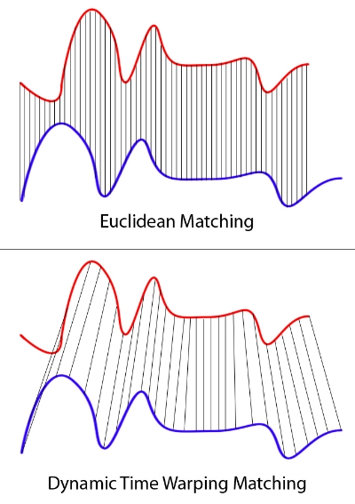
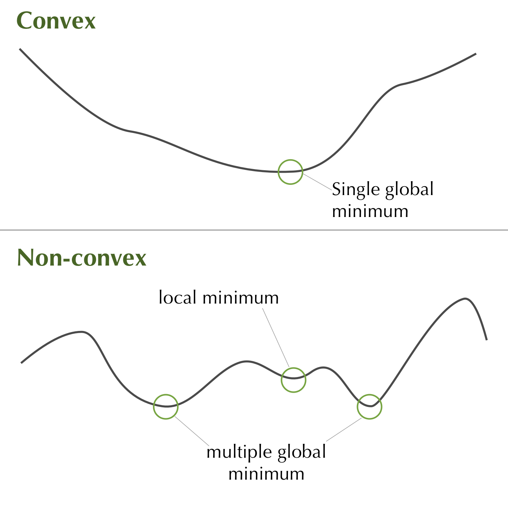

--- 
title: "Continuous Classification using Deep Neural Networks"
author: "Nick Strayer"
date: "`r Sys.Date()`"
site: bookdown::pdf_book
output:
  bookdown::pdf_book:
    toc: yes
documentclass: book
bibliography: [book.bib, packages.bib]
biblio-style: apalike
link-citations: yes
github-repo: rstudio/bookdown-demo
---

# Introduction {#intro}


## Continuous Classification 
Imagine you are watching a movie. A friend walks in late and asks "what did I miss?" You tell them the main character has just escaped from a nasty predicament and has defeated the antagonist. What you have done is classification on a sequence. The sequence in this case is the frames of the movie and your classification was what was occurring in the movie at that moment. You _could_ have given the same answer if you just saw a single frame, but most likely your assessment of the state of the movie depended on events you saw before and the context in which they placed the most recent frame. 

Continuous classification (sometimes called sequence labeling) in the context of statistics and machine learning is training models to observe data over time, like you watched the movie, and classify the status of the generating system at any given point. Sometimes seeing the most recent data is all that is needed, but more interesting and challenging problems need the algorithm to be able to make decisions about a current time while leveraging context from previous history to do so. 

This report is a brief run through past attempts at continuous classification and a deeper exploration of the current state of the art methods. 

## Potential applications of continuous classification models

The following are just a few examples of biomedical applications made possible with effective continuous classification models. 

### Activity Prediction

With the advent of wearable devices such as fitbits and apple watches, the amount of high temporal resolution data we have streaming from individuals is exploding and showing no sign of letting up. 

Continuous classification models could use these data to classify the state of the wearer at any moment. A simple example of this is detecting different exercise types (e.g. running vs. swimming); which is implemented (by unpublished methods) internally at companies such as fitbit. 

More advanced, and potentially impactful, applications include extending the predictions to more subtle but medically relevant states such as dehydration or sleep apnea (@wearable_atrial). Preliminary work in these areas using deep learning has shown surprising success with data as limited as heart-rate and motion indication being enough to predict sleep apnea and various cardiovascular risk states with a c-statistic of 0.94: comparable to invasive gold standards.


### EHR monitoring

With more and more information on patients being accrued in government and hospital databases we have a clearer than ever picture of a patient's health over long periods of time. Unfortunately, due to a combination of overwhelming quantities and noise levels in the data, our ability to make use of these data has not kept up with their quantity. 

Sequential models can help ease the burden on health practitioners in making use of these data. For instance, a model could be trained on a patient's records to predict the likelihood of cardiovascular events. This model could then alert a doctor of potential risk in order to facilitate timely interventions. This could be especially helpful in large clinical settings where personal doctor-patient relationships may not be common. For a review of the performance of deep learning models in electronic health record contexts, see @deep_ehr.

### Hospital Automation

Patient monitoring systems in hospitals have a complex web of sensors constantly reading data from patients. These systems are programmed to alert staff if different thresholds are crossed indicating the occurrence (, or likely occurrence,) of an event such as a heart attack. Continuous classification methods could assist these systems by automatically learning complex patterns related to events of interest and producing a continuous probability of an event in contrast to the traditional thresholding practice. 

By not requiring explicit checks programmed into sensors (temperature above $x$ degrees), and easily combining the signals from multiple sensors, continuous classification could both provide more personalized and sensitive detection for outcomes of interest and help hospitals more efficiently allocate resources and potentially save lives. 


## History of methods

While sources of data well suited to it have recently greatly expanded, interest in performing continuous classification is not a new topic. Many methods have been proposed for the task to varying degrees of success. Below is a brief review of some of the more successful methods and their advantages and limitations.


### Windowed regression

Perhaps the most intuitive approach to the problem of incorporating context from previous time points into your prediction is to use a windowed approach. Broadly, in these approaches a window of some width (in previous observation numbers or time length) is sequentially run over the series. The data obtained from the window may have some form of summary applied to it. This could be a mean, median, or any other function which is then used to predict with. 

By summarizing the multiple data-points into a single (or few) values noise can be removed, but at the cost of potentially throwing away useful information captured by the interval (such as trajectory.) 


```{r,  out.width = '35%', fig.align = "center",  echo = FALSE, label = "dynamictimewarp", fig.cap = "Comparison of dynamic time warping and traditional euclidean-based similarity between two time series sequences. Image courtousy of [SFL Scientific](https://sflscientific.com/data-science-blog/2016/6/3/dynamic-time-warping-time-series-analysis-ii)."}

```
  
If the time dimension of the data are kept intact more advanced methods are available. One common example is dynamic time warping (@dtw, figure \@ref(fig:dynamictimewarp)). In dynamic time warping the shape of a time series signals are matched by either squeezing or stretching the time dimension. This allows for the computation of similarity between signal patterns, rather than scale. Another common approach are kernel methods (see next section). Both of these methods allow more information to be retained in the sample but at the cost of setting a limit on how far back your model can learn dependencies in the data. For instance, if your window is one hour long but an activity lasts two hours your model will have a very hard time recognizing it. 

One way to think of the window size in these approaches is as an infinitely strong prior on the interaction timeline (@graves_rnn). No matter how strong the data support informative signals from time points $k$ steps back, if our window is less than $k$ wide, our model will never reflect this. 


### Transformation methods

As mentioned before, when a window is scanned across the time dimension of data, one of the ways of extracting information is by performing some transformation on the data. Common examples include wavelet or Fourier transforms. These methods decompose complex correlated signals into many simple components. For instance, Fourier transforms applied to accelerometer data from an individuals wrist can be used to detect the frequencies associated with walking and running (@accelerometer_activity). These methods have also been used extensively in electrical systems and signal processing to help determine the state of the system. 


```{r,  out.width = '60%', fig.align = "center",  echo = FALSE, label = "fouriertransform", fig.cap = "Example of transforming data from the data-domain to the frequency-domain for time series data. Image courtousy of [Allen D. Elster, MD FACR](http://mriquestions.com/index.html)."}
knitr::include_graphics("figures/fourier_transform.png")
```


A few limitations are imposed by these methods. First, as previously mentioned, they are subject to the windowing constraints. Secondly, they rely on the data to be periodic or oscillatory in nature. For instance, accelerometer data oscillates back and forth as the individual swings their arms and electrical systems are inherently oscillatory. Data such as heart-rate or step counts produced by devices like apple watches and fitbits are a rather stable signal ^[Although the raw data the sensors receive may not be.] and thus transformation methods are unable to separate them into frequency domains at small time scales. In addition, these methods are unable to deal with non-numeric data which severally limits them in heterogeneous data domains such as EHR data. 


### Hidden Markov Models

In an attempt to deal with the fact that in most scenarios the classification of time point $t$ is dependent on that of previous time points, hidden Markov models (or HMMs)  model data as a series of observations generated by a system transitioning between some unobserved (or latent) states. This is done by constructing a transition matrix that denotes the probability of transitioning from one state to another and conditioning it on whatever observed data you have. This can be thought of in mathematical form as the the probability of transitioning from one state $s_a$ to another $s_b$ given some input data at time t ($x_t$).

$$P(s_a -> s_b | x_t) = ...$$

This allows the model to learn time dependencies in the data. For instance, if a person is running now their next state is probably going to be walking rather than sitting or swimming. 

HMMs were the state of the art models on continuous classification problems until very recently and are still very valuable for many problems. However, their greatest advantage is also their greatest disadvantage. 

The Markov property (or the first 'M' in HMM) implies that the next state of the system being modeled depends exclusively on the current state. This means that the model is 'memory-less.' For instance, returning to our running example, say an individual had been running in the previous time point, the model will most likely pick walking as their next state (ignoring any conditional data for simplicity) but what if before they were running they were swimming? This fact from multiple time-steps before would strongly hint that the next state would in fact be biking and not walking (they are running a triathlon.) 

There are ways to fix this such as extending the model's transition probabilities to multiple time-steps, however the number of parameters needed to estimate transition probabilities for $m$ previous time steps is (# of classes) to the $k^{th}$ power: $m^k$, which rapidly becomes intractable.  In addition, we have to a priori decide the number of time steps in the past that matter.

### Advantages of deep learning methods

Before we dive into the mathematical underpinnings of deep learning methods we will go over how they solve many of the aforementioned issues from traditional methods. 

#### Less Domain Knowledge Needed
One of the ways that it helps to think about deep learning is as a computer program that programs itself given an objective and examples. In his popular blog post [_Software 2.0_](https://medium.com/@karpathy/software-2-0-a64152b37c35) Andrej Karapathy makes the argument that deep learning is powerful because it helps avoid the tedious process pf explicitly defining the context surrounding cases the computer is supposed to detect. One of the ways this is applicable to our problems is the ability for deep learning models to adapt to a wide range of problem/ data domains without much human-defined customization. 

One demonstration of this advantage is less manual manipulation of data is needed before it can be used in models. If you had data from an accelerometer it could be fit with the same neural network as data from a more static heart-rate sensor would. The models are flexible enough to learn how to deal with different input patterns and characteristics without requiring the researcher to explicitly define a transformation. This independence from large amounts of human intervention has the potential to make performance assessments more accurate by automating most parts of the model fitting process (@rms). 

#### Can find and deal with arbitrary time dependencies
Deep learning models are theoretically capable of learning time dependencies of infinite length and strength (@universal_approximators). While obviously it is impossible to supply a network with enough data to fit the number of parameters necessary to do so, the fact remains that deep learning methods are capable of handling long-term time dependencies. In addition to being able to model these dependencies they do so without any need for explicitly telling the model the length of the dependencies and also using substantially fewer parameters than an extended hidden Markov model (@graves_rnn).

For example, a recurrent neural network (RNN) can automatically learn that if a person swims and then runs, they will most likely be biking next, but it could also remember that a patient was given a flu vaccine three months prior and thus their symptoms most likely don't indicate the flu but a cold. This flexibility to automatically learn arbitrary time dependency patterns is powerful in not only its ability to create accurate models, but potentially for exploration of causal patterns. 


#### Multiple architectures for solving traditional problems
In a similar vein, one of the decisions that does need to be made with deep learning: which network architecture to use, conveniently is rather robust to the problem of continuous classification. For instance: convolutional neural networks that have achieved great success in computer vision were actually originally designed for time series data, and recent advances such as dilated convolutions (@dilated_convolutions)(convolutions with gaps in their input dimension to allow for increasing context size as layers progress deeper) allow for them to search as far back in the time-series as needed to find valuable information for classification. Recurrent neural networks (which will be elaborated on in the following sections) are also fantastic for time-series data, as they explicitly model the autocorrelation found in the data via a recurrent cycle in their computation graph. This allows them to read data much like one reads a book, selectively remembering past events that have applicability to the current state. 


#### Downsides

As a result of being so flexible deep learning models require a lot of data to properly tune all their parameters without over fitting. In addition, they require computationaly expensive optimization procedures. 

Neural network optimization can not be calculated with a closed form solution, thus requiring the use of iterative methods to traverse the objective (or cost/loss) function. The training of neural networks is a non-convex problem. Meaning there is no guarantee that a found minima is a global minima and that for any global minima, there is no guarantee that it is unique. 

```{r,  out.width = '60%', fig.align = "center",  echo = FALSE, label = "convexoptim", fig.cap = "Comparison of the objective surface of a convex and non-convex optimization problem."}

```

The fact that neural networks need a lot of data and require costly optimization procedures means they are very computationally intensive to train. 

Another downside, although one shared by many other approaches described here, is that neural networks are not amenable to inference on specific factors contributing to their classifications. The nature of neural networks as a "black-box" method can decrease trust in the models and also can hide cases where the model has learned to classify on potential un-intentional characteristics of the training set (such as the instrument that took measurements instead of the measurements themselves).

These downsides and potential solutions are explored in the last chapter. 

In the next chapter we will go over the basics of modern deep neural networks. 


